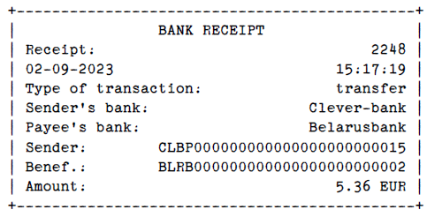
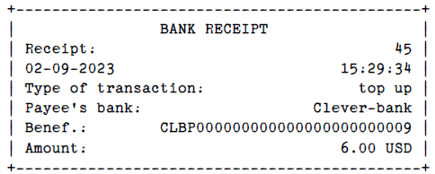
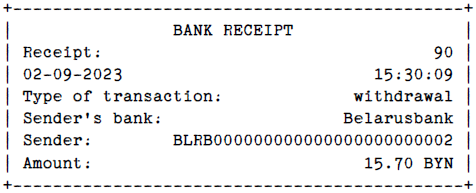
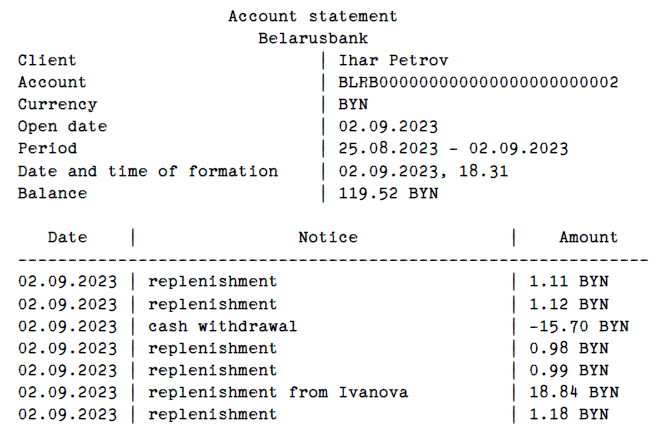
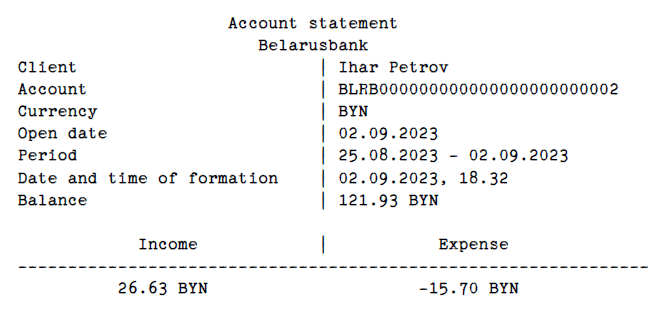

## Test task from the company Clevertec.
### An application for managing bank accounts and making transactions.
#### Author: Nikita Semeniuk.
### Description.
#### The idea of the application is to manage user accounts created in different banks and currencies, as well as to replenish the current account, withdraw cash, and transfer funds from one user to another.
#### An important nuance that should be noted is that, from the point of view of banking operations, transactions carried out in the system are divided into incoming and outgoing transactions. This feature is crucial when designing a "transaction" relationship in a database.
### How to use.
#### 1. If necessary, override application settings in the properties file.
#### 2. Compile the source code of the program.
#### 3. Run the application in the Tomcat servlet container or use the web application launching tools provided by your IDE.
#### 4. Open Postman and run the required requests to the application.
### Input data examples.
#### 1. To get data by id use GET request:
##### http://localhost:8080/accounts/1, http://localhost:8080/banks/1, http://localhost:8080/users/1
#### 2. To get all data use GET request
##### http://localhost:8080/accounts?page=1&size=2
#### 3. To get extract use GET request
##### http://localhost:8080/accounts/extract
{"accountNumber": "BLRB000000000000000000000002", "periodFrom": "25.08.2023", "periodTo": "05.09.2023"}
#### 4. To get money statement use GET request
##### http://localhost:8080/accounts/statement
{"accountNumber": "BLRB000000000000000000000002", "periodFrom": "25.08.2023", "periodTo": "05.09.2023"}
#### 5. To delete data use DELETE request
##### http://localhost:8080/accounts/1
#### 6. To update data use PUT request
##### http://localhost:8080/accounts/1
{"id": 1, "bankIdentifier": "BLRB", "amount": 100.00}
##### http://localhost:8080/banks/1
{"id": 1, "name": "new name" "bankIdentifier": "NBRB"}
##### http://localhost:8080/users/1
{"id": 1, "firstName": "firstName", "lastName": "lastName", "email": "email@email.com"}
#### 7. To create data, commit transaction use POST request
##### http://localhost:8080/users
{"firstName": "firstName", "lastName": "lastName", "email": "email@email.com"}
##### http://localhost:8080/banks
{"name": "new name" "bankIdentifier": "NBRB"}
##### http://localhost:8080/accounts
{"email": "email@email.com", "bankIdentifier": "BLRB", "currency": "GDP"}
##### http://localhost:8080/transactions
transfer: {"fromNumber": "CLBP000000000000000000000015", "toNumber": "BLRB000000000000000000000002", "amount": 5, "currency": "GDP"}
top up: {"toNumber": "CLBP000000000000000000000009", "amount": 5, "currency": "GDP"}
withdraw: {"fromNumber": "BLRB000000000000000000000002", "amount": 5, "currency": "USD"}
### Output data examples.
{"id": 1, "number": "BLRB000000000000000000000001", "user": {"id": 1, "firstName": "Andrew", "lastName": "Ivanov", "email": "ivanov@mail.com"}, "bank": {"id": 1, "name": "Belarusbank", "bankIdentifier": "BLRB"}, "amount": 106.26, "currency": "BYN", "openTime": "02/09/2023"}
#### You can see examples of output for other requests in the body of the responses when executing the corresponding requests. In addition, examples of receipt, account statements and account balances are presented below.

